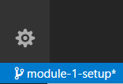
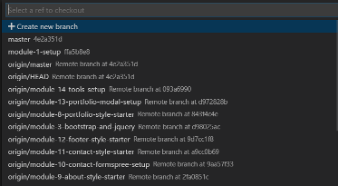

# Module 1 - Project Structure

### Key Objectives
* Set up folders and files
* Set up in the html structure
* Connect script files and css files
* Set up a portfolio repo

### Overview 
This module walks through how we started working on the sample project. Be sure
to check out the starter video. After you watch the video, try to build 
your own version of it in the steps below. https://www.youtube.com/watch?v=iLotiOLky0g

### Notes/Tips
1. Ensuring files names are properly named from the beginning is going to cause 
   less frustrustation in the long run. Take your time and do it right the first
   time. Commit your code when you are finished.
2. Don't blindly copy and paste. Look up what you don't understand. Watch the video.
3. Play around with the code, get in the weeds of it. The wonders of branches allow
   us to experiment and not affect our remote branch.
4. If you do make changes you can either commit them or do a `git reset --hard` to 
   make them go away.
5. Remember, this code is written in your own project file, not the starter project.

### Steps
1. Please start by taking a look at the instructional video.
2. Where needed, pause the video and check to be sure that you are on the module-1-setup
   branch in the example project. Again, you can do this by clicking in the lower left
   corner in VS Code and selecting your desired branch at the top of the screen.
    
    
3. Now that you are on the branch, listen to how you would get a project like this started.
4. Start building **your own version** of the project. Things that you'll want to do in this
   phase:
   * Set up your folder structure parallel to our project. You'll need a whole new project.
   * Add empty files in folders. Put comments at the top like ours.
   * In index.html, get started by structuring all the parent tags(navbar, header, section,
     footer, etc.), as seen in the index.html. This might change later.
   * In the index.html hook up the basic link and script tags.
   * To get your project up and running in the browser:
    * Open your terminal.
    * Run the following: `npm install -g http-server`
    * Then, run the following: `http-server`
    * Go to `localhost:8080`(or your port number)
    * Check to make sure he bg color has changed.
    * To turn off http-server, press ctrl + c and then y.
    * Create a git repository locally.
    * Create a git repository on Github(the remote).
    * Commit your code and push it to your Github repository when finished.

After you complete these tasks and have a different colored background in your project, go
back to the sample project and switch to the `module-2-gulp` branch. 
